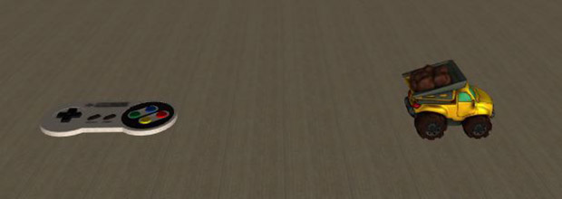
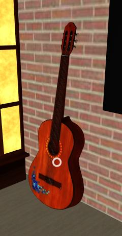

# CS 4331 - Project #1

## My home

### Video
[](https://youtu.be/nHF2N1Vu8Pc)

### Instruction Panel

This panel tells the users what they are able to do in the scene and how to do it. So, it is not obscure.


### Interactions/Animations

#### Teleportation Pads

When you look at a poster on the wall or the instruction panel in the middle of the scene, you will teleport to a location close to that poster.


```
AFRAME.registerComponent('collider-check', {
  init: async function() {
    this.el.addEventListener("raycaster-intersected", evt => {
      this.intersectingRaycaster = evt.detail.el.components.raycaster;
      setTimeout(() => {
        if (this.intersectingRaycaster != null && sceenLoaded && !intersectedIn) {
          switch (evt.srcElement.id) {
            case "top-tp":
              movePlayer('0 0 -8')
              intersectedIn = true;
              break;
            case "left-tp":
              movePlayer('8 0 2')
              intersectedIn = true;
              break;
            case "right-tp":
              movePlayer('-8 0 0')
              intersectedIn = true;
              break;
            case "back-tp":
              movePlayer('2 0 8')
              intersectedIn = true;
              break;
            case "middle-tp":
              movePlayer('0 0 0')
              intersectedIn = true;
              break;

              ...CODE...

            default:
          }
        }
      }, 1500)
    });
  }
});

function movePlayer(position) {
  player.setAttribute("position", position);
}
```

```
<!-- (TELEPORT PADS) -->
<a-plane position="-9.962 1.699 1.832" rotation="0 90 0" class="teleporter" id="right-tp" collider-check src="./assets/images/poster1.jpg"></a-plane>
<a-plane position="9.962 1.699 1.832" rotation="0 -90 0" class="teleporter" id="left-tp" collider-check src="./assets/images/poster2.jpg"></a-plane>
<a-plane position="-4.005 1.699 -9.931" class="teleporter" id="top-tp" collider-check src="./assets/images/poster3.jpg"></a-plane>
<a-plane position="3.750 1.5 9.969" rotation="0 180 0" class="teleporter" id="back-tp" collider-check src="./assets/images/poster4.jpg"></a-plane>
```

#### Moving Truck

When you hover your cursor over the remote control in the middle of the scene it will trigger the truck to move to the right then back to its original position.

Base:<br/>
<br/>
Active:<br/>

```
AFRAME.registerComponent('collider-check', {
  init: async function() {
    this.el.addEventListener("raycaster-intersected", evt => {
      this.intersectingRaycaster = evt.detail.el.components.raycaster;
      setTimeout(() => {
        if (this.intersectingRaycaster != null && sceenLoaded && !intersectedIn) {
          switch (evt.srcElement.id) {

            ...CODE...

            case "controller":
              let car = document.querySelector('#car')
              if (!evt.srcElement.active) {
                evt.srcElement.active = true;
                car.setAttribute('animation', 'property:position; to: 4 .075 -2.569; dur: 2000; easing: linear;')
              }
              setTimeout(function() {
                car.setAttribute('animation', 'property:rotation; to: 0 270 0; dur: 2000; easing: linear;')
                setTimeout(function() {
                  car.setAttribute('animation', 'property:position; to: 1 .075 -2.569; dur: 2000; easing: linear;')
                  setTimeout(function() {
                    car.setAttribute('animation', 'property:rotation; to: 0 90 0; dur: 2000; easing: linear;')
                    evt.srcElement.active = false;
                  }, 2000)
                }, 2000)
              }, 2000)
              intersectedIn = true;
              break;

              ...CODE...

            default:
          }
        }
      }, 1500)
    });

  }
});
```

```
<!-- Model #10  CAR -->
<a-gltf-model position="1 .075 -2.569" scale=".1 .1 .1" rotation="0 90 0" src="#carD" id="car"></a-gltf-model>

<!-- Model #11  CONTROLLER -->
<a-gltf-model position="-.880 .133 -2.488" scale=".001 .001 .001" rotation="-90 0 0" src="#controller" class="controller" id="controller" collider-check active="false"></a-gltf-model>
```
#### Lamp

If you look at the switch on the lamp you can turn off and on the lamp.

Base: <br/>
<br/>
Active: <br/>
<br/>

```
AFRAME.registerComponent('collider-check', {
  init: async function() {
    this.el.addEventListener("raycaster-intersected", evt => {
      this.intersectingRaycaster = evt.detail.el.components.raycaster;
      setTimeout(() => {
        if (this.intersectingRaycaster != null && sceenLoaded && !intersectedIn) {
          switch (evt.srcElement.id) {

            ...CODE...

            case "desk-lamp-base":
              evt.srcElement.active = !evt.srcElement.active;
              let light = document.querySelector('#desk-lamp-light')
              let lightR = document.querySelector('#desk-lamp-light-real')
              if (evt.srcElement.active) {
                lightActiveStatus = evt.srcElement.active;
                light.setAttribute('color', '#fffa61');
                lightR.setAttribute('intensity', .5);
                lightR.setAttribute('color', '#fffa61');
              } else {
                lightActiveStatus = evt.srcElement.active;
                light.setAttribute('color', '#fff');
                lightR.setAttribute('intensity', 0);
              }
              intersectedIn = true;
              break;

              ...CODE...

            default:
          }
        }
      }, 1500)
    });

  }
});
```
```
<!-- Self Created Model #4  LAMP-->
<a-entity position="8.8 1.06 .4" rotation="0 45 0" collider-check id="desek-lamp" active="false">
  <a-sphere scale=".14 .14 .14" position="-.17 .581 .002" color="#515336"></a-sphere>
  <a-sphere scale=".15 .15 .15" position="-0.19 .581 .002" id="desk-lamp-light"></a-sphere>
  <a-box scale=".05 .03 .05" position="-.051 .161 -.009" id="desk-lamp-light" color="#000"></a-box>
  <a-cylinder scale=".1 .05 .1" position="0 .14 0" id="desk-lamp-base" class="lighting"></a-cylinder>
  <a-cylinder scale=".01 .05 .01" position="-.02 .58 0" rotation="90 90" color="#515336"></a-cylinder>
  <a-cylinder scale=".01 .5 .01" position="0 0.4 0" color="#515336"></a-cylinder>
  <a-light type="hemisphere" color="#fffa61" position="-0.19 .581 .002" id="desk-lamp-light-real" intensity=0></a-light>
</a-entity>
<!-- Self Created Model #4  END-->
```
#### Color Light Buttons

While the lamp is on and you look at the colors on the button box, you can change the color of the lamp.

Blue Switch: <br/>
<br/>
Green switch: <br/>
<br/>
Red switch: <br/>
<br/>
```
AFRAME.registerComponent('collider-check', {
  init: async function() {
    this.el.addEventListener("raycaster-intersected", evt => {
      this.intersectingRaycaster = evt.detail.el.components.raycaster;
      setTimeout(() => {
        if (this.intersectingRaycaster != null && sceenLoaded && !intersectedIn) {
          switch (evt.srcElement.id) {

            ..CODE...

            case "light-color-red":
              if (lightActiveStatus) {
                let light = document.querySelector('#desk-lamp-light')
                let lightR = document.querySelector('#desk-lamp-light-real')
                light.setAttribute('color', '#ff0000')
                lightR.setAttribute('color', '#ff0000')
              }
              intersectedIn = true;
              break;
            case "light-color-green":
              if (lightActiveStatus) {
                let light = document.querySelector('#desk-lamp-light')
                let lightR = document.querySelector('#desk-lamp-light-real')
                light.setAttribute('color', '#11ff00')
                lightR.setAttribute('color', '#11ff00')
              }
              intersectedIn = true;
              break;
            case "light-color-blue":
              if (lightActiveStatus) {
                let light = document.querySelector('#desk-lamp-light')
                let lightR = document.querySelector('#desk-lamp-light-real')
                light.setAttribute('color', '#0008ff')
                lightR.setAttribute('color', '#0008ff')
              }
              intersectedIn = true;
              break;

              ..CODE...

            default:
          }
        }
      }, 1500)
    });
  }
});
```
```
<!-- Self Created Model #6  COLOR BOARD-->
<a-entity position="10 1.713 1.109" rotation="0 0 90">
  <a-box scale=".5 .05 .3" position="0" color="#6e6e6e"></a-box>
  <a-box scale=".1 .1 .1" position=".175 .026 0" color="#ff0000" collider-check id="light-color-red" class="lighting"></a-box>
  <a-box scale=".1 .1 .1" position=".026 .026 0" color="#11ff00" collider-check id="light-color-green" class="lighting"></a-box>
  <a-box scale=".1 .1 .1" position="-.130 .026 0" color="#0008ff" collider-check id="light-color-blue" class="lighting"></a-box>
</a-entity>
<!-- Self Created Model #6  END-->
```

#### Guitar

If you are using this on your browser on your desktop, and hover over the guitar you can hear a guitar sound playing. Why can't you hear it on your phone? Because of the IOS privacy settings it has made it harder to make sounds play automatically and requires more steps. If I had extra time, I probably could have figured something out and worked out the kinks. However, now it only plays on desktop. (Maybe Andriod? I don't know I don't own one.)

Guitar: <br/>
<br/>

```
AFRAME.registerComponent('sound-check', {
  init: async function() {
    this.el.addEventListener("raycaster-intersected", evt => {
      this.intersectingRaycaster = evt.detail.el.components.raycaster;
          let guitar = document.querySelector('[sound]');
          guitar.components.sound.playSound();
    });
    this.el.addEventListener("raycaster-intersected-cleared", () => {
      this.intersectingRaycaster = null;
      intersectedIn = false;
    });
  }
});
```
```
<!-- Model #5  GUITAR -->
<a-gltf-model position="-1.874 .750 -9.876" scale=".1 .1 .1" rotation="80 0 0" src="#guitar" sound-check sound="src: ./assets/sound/acoustic.mp3; autoplay: false" id="guitar" class="sound"></a-gltf-model>
```

#### Moveable Box

The box near the bed is a moveable object! The object will follow the cursor of the user for about 3 seconds before it lets go of the cursor. To reactive it, just look at it again!

Base: <br/>
<br/>
Active: <br/>
<br/>
```
AFRAME.registerComponent('moveable-check', {
  init: async function() {
    this.el.addEventListener("raycaster-intersected", evt => {
      this.intersectingRaycaster = evt.detail.el.components.raycaster;
          boxMoveable = true;
          setTimeout(function(){
            boxMoveable = false;
          },3000)
    });
    this.el.addEventListener("raycaster-intersected-cleared", () => {
      this.intersectingRaycaster = null;
      intersectedIn = false;
    });
  },
  tick: async function() {
    let cursor = document.querySelector("#cursor");
    let box1 = document.querySelector("#moveablebox1");
    var wpVector = new THREE.Vector3();
      if(boxMoveable) {
        box1.setAttribute('position', cursor.object3D.getWorldPosition(wpVector).x +" "+  (cursor.object3D.getWorldPosition(wpVector).y) +" "+ (cursor.object3D.getWorldPosition(wpVector).z))
      }
  }

});
```
```
<!-- Model #12 AMAZON BOX -->
<a-gltf-model position="4.641 0.050 8.280" scale=".02 .02 .02" rotation="0 90 0" src="#box" moveable-check id="moveablebox1" class="moveable"></a-gltf-model>
```

#### Moveable Spray bottle + Covid Mode game
When covid mode is active a spray bottle will appear. If you pick up the spray bottle you can removed covid particles from the air.
Spray Base: <br/>
<br/>
Spray Active: <br/>
<br/>

#### COVID-19 Mode

The button labeled covid mode will toggle covid mode on and off.
The differences is that there's a lot more Amazon boxes and Pizza boxes. Also, tape around the door meaning the person can not go outside.
The reason behind this is because during COVID I've eaten/ordered a lot of pizza and ordered a lot from Amazon. Also I haven't been outside for awhile now.

Button Base: <br/>
<br/>
Button Active: <br/>
<br/>

COVD-19 Mode OFF: <br/>
<br/>
COVD-19 Mode ON: <br/>
<br/>
COVD-19 Mode Game: <br/>
<br/>
```
AFRAME.registerComponent('collider-check', {
  init: async function() {
    this.el.addEventListener("raycaster-intersected", evt => {
      this.intersectingRaycaster = evt.detail.el.components.raycaster;
      setTimeout(() => {
        if (this.intersectingRaycaster != null && sceenLoaded && !intersectedIn) {
          switch (evt.srcElement.id) {

            ..CODE...

            case "covid-mode":
              let covidmode = document.querySelector('#covid-mode-scene');
              let covidmodeButton = document.querySelector('#covid-mode');
              evt.srcElement.active = !evt.srcElement.active;
              if (evt.srcElement.active) {
                covidmode.setAttribute('visible', true);
                covidmodeButton.setAttribute('color', '#11ff00')
              } else {
                covidmode.setAttribute('visible', false);
                covidmodeButton.setAttribute('color', '#ff0000')
              }
              intersectedIn = true;
              break;

              ..CODE...
            default:
          }
        }
      }, 1500)
    });

  }
});
```
```
<!-- Self Created Model #6  COVID MODE-->
<a-entity position="10 1.713 2.592" rotation="0 0 90">
  <a-plane position=".177 .006 .007" rotation="-90 -90 0" scale=".3 .1 1" src="./assets/images/covid.jpg"></a-plane>
  <a-box scale=".2 .05 .2" position="" color="#6e6e6e"></a-box>
  <a-box scale=".1 .1 .1" position="0 0 0" color="#ff0000" collider-check id="covid-mode" class="lighting" active="false"></a-box>
</a-entity>

<a-entity visible="false" id="covid-mode-scene">
  <a-entity position="0 .06 -4.6" rotation="90 0 180">
    <a-box src="#pizzaboxsprite" scale="1 1 .1" position="0 0 0"></a-box>
    <a-box src="#pizzaboxsprite" scale="1 1 .1" position="0 0 -.095" rotation="00 0 45"></a-box>
    <a-box src="#pizzaboxsprite" scale="1 1 .1" position="0 0 -.201"></a-box>
  </a-entity>

  <a-entity position=".033 .06 -9.376" rotation="90 0 180">
    <a-box src="#pizzaboxsprite" scale="1 1 .1" position="0 0 0"></a-box>
    <a-box src="#pizzaboxsprite" scale="1 1 .1" position="0 0 -.095" rotation="00 0 45"></a-box>
    <a-box src="#pizzaboxsprite" scale="1 1 .1" position="0 0 -.201"></a-box>
  </a-entity>

  <a-entity class="covid-ball" destory-covid position=" .170 1.092 0">
    <a-sphere scale=".03 .03 .03" color="#B2AFAF" destory-covid class="covid-core"></a-sphere>
    <a-entity position="0 .0 0" rotation="90 90 0">
      <a-cylinder scale=".005 .1 .005" color="#7D1717"></a-cylinder>
      <a-sphere scale=".01 .01 .01" position="0 .052 0" color="#7D1717"></a-sphere>
      <a-sphere scale=".01 .01 .01" position="0 -.052 0" color="#7D1717"></a-sphere>
    </a-entity>
    <a-entity position="0 .0 0" rotation="90 0 0">
      <a-cylinder scale=".005 .1 .005" color="#7D1717"></a-cylinder>
      <a-sphere scale=".01 .01 .01" position="0 .052 0" color="#7D1717"></a-sphere>
      <a-sphere scale=".01 .01 .01" position="0 -.052 0" color="#7D1717"></a-sphere>
    </a-entity>
    <a-entity position="0 .0 0" rotation="0 90 0">
      <a-cylinder scale=".005 .1 .005" color="#7D1717"></a-cylinder>
      <a-sphere scale=".01 .01 .01" position="0 .052 0" color="#7D1717"></a-sphere>
      <a-sphere scale=".01 .01 .01" position="0 -.052 0" color="#7D1717"></a-sphere>
    </a-entity>
    <a-entity position="0 .0 0" rotation="180 180 0">
      <a-cylinder scale=".005 .1 .005" color="#7D1717"></a-cylinder>
      <a-sphere scale=".01 .01 .01" position="0 .052 0" color="#7D1717"></a-sphere>
      <a-sphere scale=".01 .01 .01" position="0 -.052 0" color="#7D1717"></a-sphere>
    </a-entity>
    <a-entity position="0 .0 0" rotation="180 0 0">
      <a-cylinder scale=".005 .1 .005" color="#7D1717"></a-cylinder>
      <a-sphere scale=".01 .01 .01" position="0 .052 0" color="#7D1717"></a-sphere>
      <a-sphere scale=".01 .01 .01" position="0 -.052 0" color="#7D1717"></a-sphere>
    </a-entity>
    <a-entity position="0 .0 0" rotation="0 180 0">
      <a-cylinder scale=".005 .1 .005" color="#7D1717"></a-cylinder>
      <a-sphere scale=".01 .01 .01" position="0 .052 0" color="#7D1717"></a-sphere>
      <a-sphere scale=".01 .01 .01" position="0 -.052 0" color="#7D1717"></a-sphere>
    </a-entity>
    <a-entity position="0 .0 0" rotation="270 270 0">
      <a-cylinder scale=".005 .1 .005" color="#7D1717"></a-cylinder>
      <a-sphere scale=".01 .01 .01" position="0 .052 0" color="#7D1717"></a-sphere>
      <a-sphere scale=".01 .01 .01" position="0 -.052 0" color="#7D1717"></a-sphere>
    </a-entity>
    <a-entity position="0 .0 0" rotation="270 0 0">
      <a-cylinder scale=".005 .1 .005" color="#7D1717"></a-cylinder>
      <a-sphere scale=".01 .01 .01" position="0 .052 0" color="#7D1717"></a-sphere>
      <a-sphere scale=".01 .01 .01" position="0 -.052 0" color="#7D1717"></a-sphere>
    </a-entity>
    <a-entity position="0 .0 0" rotation="0 270 0">
      <a-cylinder scale=".005 .1 .005" color="#7D1717"></a-cylinder>
      <a-sphere scale=".01 .01 .01" position="0 .052 0" color="#7D1717"></a-sphere>
      <a-sphere scale=".01 .01 .01" position="0 -.052 0" color="#7D1717"></a-sphere>
    </a-entity>
    <a-entity position="0 .0 0" rotation="145 145 0">
      <a-cylinder scale=".005 .1 .005" color="#7D1717"></a-cylinder>
      <a-sphere scale=".01 .01 .01" position="0 .052 0" color="#7D1717"></a-sphere>
      <a-sphere scale=".01 .01 .01" position="0 -.052 0" color="#7D1717"></a-sphere>
    </a-entity>
    <a-entity position="0 .0 0" rotation="145 0 0">
      <a-cylinder scale=".005 .1 .005" color="#7D1717"></a-cylinder>
      <a-sphere scale=".01 .01 .01" position="0 .052 0" color="#7D1717"></a-sphere>
      <a-sphere scale=".01 .01 .01" position="0 -.052 0" color="#7D1717"></a-sphere>
    </a-entity>
    <a-entity position="0 .0 0" rotation="270 45 0">
      <a-cylinder scale=".005 .1 .005" color="#7D1717"></a-cylinder>
      <a-sphere scale=".01 .01 .01" position="0 .052 0" color="#7D1717"></a-sphere>
      <a-sphere scale=".01 .01 .01" position="0 -.052 0" color="#7D1717"></a-sphere>
    </a-entity>
    <a-entity position="0 .0 0" rotation="270 30 0">
      <a-cylinder scale=".005 .1 .005" color="#7D1717"></a-cylinder>
      <a-sphere scale=".01 .01 .01" position="0 .052 0" color="#7D1717"></a-sphere>
      <a-sphere scale=".01 .01 .01" position="0 -.052 0" color="#7D1717"></a-sphere>
    </a-entity>
  </a-entity>
</a-entity>
```
## Sources

### Frameworks

* aframe - https://aframe.io/
* aframe extras - https://github.com/n5ro/aframe-extras
### Models

11 unique models were used in building this project.

* Night Stand - https://sketchfab.com/3d-models/simple-nightstand-26d08ce396454ee3bd56ffa160e6538b
* Bed - https://sketchfab.com/3d-models/bed-403c4a48e5ea4a9fbbb9a096d90973af
* Guitar - https://sketchfab.com/3d-models/classical-guitar-ad63274604e4416a86a1175d63cadeff
* Gym - https://sketchfab.com/3d-models/gym-multiple-df5e938192244b82a1e59c7145030ee0
* Bookshelf - https://sketchfab.com/3d-models/bookshelf-b8f46cf7daca419a87ac8d131bad056f
* Plant - https://sketchfab.com/3d-models/indoor-pot-plant-3-8ad9b497549f42d4b8fa798828d6ec1e
* Truck - https://sketchfab.com/3d-models/dumptruck-qCWXrNLMlMOEtD5rcS0zOKbdkbB
* Spray Bottle - https://sketchfab.com/models/1611833f3eaa41bbba2b6944269429ab
* Japanese Lamp - https://sketchfab.com/models/e816f01aa14b4af99a582b4d6a8cbdd0
* Window - https://sketchfab.com/models/ce64c54fc8fb443c8135ac2caa2e9243
* Box - https://sketchfab.com/models/0641e66ea33c415694cf84f786178960


9 Unique Custom made models were used in building this project.
* Table
* Chair
* Sofa
* Lamp
* Truck Controller
* Door
* Covid Ball
* Color Board Buttons
* Covid Mode Button

### Textures

* Pizza Hut Box - https://live.staticflickr.com/1156/5149222704_75099d2392_n.jpg
* Caution Tape - https://thumbs.dreamstime.com/t/warning-frame-grunge-yellow-black-diagonal-stripes-vector-grunge-texture-warn-caution-construction-safety-background-warning-frame-137272851.jpg
* Floor/Ceiling - https://www.textures.com/system/gallery/photos/3D%20Scans/125667/3DScans0024_48_download600.jpg
* Wall - https://www.textures.com/system/gallery/photos/3D%20Scans/132342/3DScans0393_13_download600.jpg
### Art

* Painting 1 - https://www.etsy.com/listing/704185211/bold-and-brash-print-poster?gpla=1&gao=1&&utm_source=google&utm_medium=cpc&utm_campaign=shopping_us_ts1-c-art_and_collectibles-prints-digital_prints&utm_custom1=50c105c2-bac8-43c3-b98c-64228306159c&utm_content=go_2063581104_76452839735_367965825297_pla-328046931108_c__704185211&utm_custom2=2063581104&gclid=Cj0KCQjwqrb7BRDlARIsACwGad4Fk2wWWYSh-ry69LsPoFqbqWb43p2p7COnG4MDi7EN5Jy0tLggQaoaAvqjEALw_wcB
* Painting 2 - https://www.etsy.com/listing/711251717/my-hero-academia-poster-bakugou-katsuki?ref=pla_similar_listings_top_ad-1&plkey=bb77bac81caafa9704689595a7cb2e4704fe960b%3A711251717&frs=1
* Painting 3 - https://www.etsy.com/listing/262615370/dead-and-company-official-screen-printed?ga_order=most_relevant&ga_search_type=all&ga_view_type=gallery&ga_search_query=print+poster&ref=sc_gallery-1-19&plkey=a52ed39531ee31c86c754623d7a30a1360e28be7%3A262615370&frs=1&sca=1
* Painting 4 - http://muvial.blogspot.com/2013/01/normal-0-false-false-false-en-us-x-none.html

## References

* [A-frame](https://aframe.io/)
